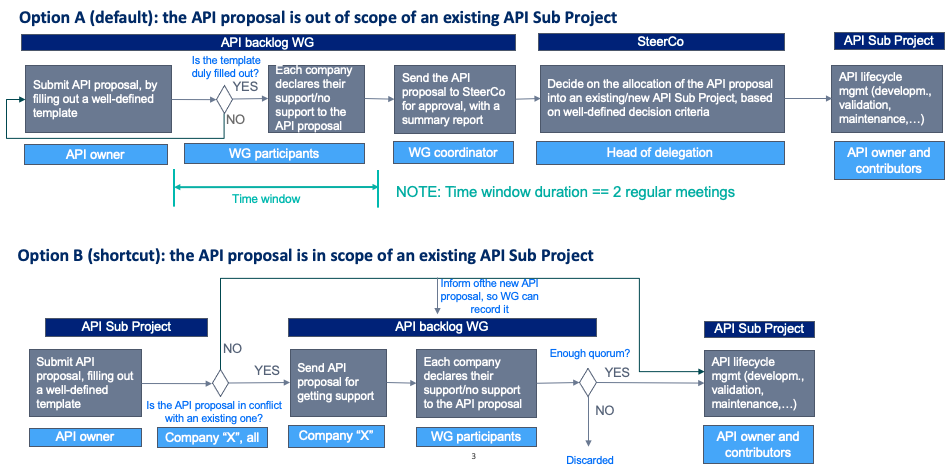

# API onboarding and management in CAMARA

## Table of Contents

  - [Introduction](#introduction)
  - [API proposal template](#api-proposal-template)
  - [API proposal summary report](#api-proposal-summary-report)
  - [API proposal ballot](#api-proposal-ballot)
    - [Main tenets for SC voting](#main-tenets-for-sc-voting)
  - [API backlog maintenance](#api-backlog-maintenance)

## Introduction

This document aims at reporting a clear, consistent and transparent process for the onboarding (submission) and management (maintenance) of API proposals in CAMARA project. The process explained herein applies for both CAMARA companies and partner organizations (e.g. [OPG](https://www.gsma.com/futurenetworks/5g-operator-platform/)'s OPAG and [5GFF](https://www.verizon.com/about/5g-future-forum)).

The process pipeline is depicted in the figure below. The CAMARA company or partner organization acting as API owner shall decide which option to go for, depending on whether the API proposal fits within the scope of an existing Sub-Project (see current list [here](https://github.com/camaraproject)) or not. 

Details and clarifications on the stages conforming this pipeline are provided in the upcoming sections. 

## API proposal template
The pipeline is triggered with the submission of the API proposal. To that end, the API owner shall fill out the template available [here](https://github.com/camaraproject/WorkingGroups/blob/main/Commonalities/documentation/Deliverables/API-proposal-template.md). 

This template will be used as a **checklist** to decide on including/not including the API proposal in the backlog.

Instructions for submission: 
- API template name: `APIproposal_<APIname>_<owner>.md`
- Submission directory: the template shall be posted at [APIBacklog WG]((https://github.com/camaraproject/WorkingGroups/tree/main/APIBacklog) (if option A) or to the specific API Sub Project (if option B). 

Upon submission, the API proposal is formally registered in CAMARA. From this moment on:
- The APIBacklog coordinator validates that the API proposal is duly filled out. If some input is missing, the API owner will be notified accordingly, so an amended version can be re-submitted. 
- Once sanity check is done, the APIBacklog WG participants shall declare their support/no support to the API proposal. For this activity, a reference time window of duration has been defined. 

## API proposal summary report
Once the time window gets finalized, the [APIBacklog WG](https://github.com/camaraproject/WorkingGroups/tree/main/APIBacklog) coordinator shall prepare a summary report for the API proposal. The structure of this report is available [here](https://github.com/camaraproject/WorkingGroups/blob/main/Commonalities/documentation/Deliverables/API-Summary-report-template.md). 

The [APIBacklog WG](https://github.com/camaraproject/WorkingGroups/tree/main/APIBacklog) coordinator will send the summary report to the Steering Committee (SC) at least **one week prior** to the SC meeting where the API proposal will be voted upon. 

## API proposal ballot
Upon receiving the summary report and notification from the [APIBacklog WG](https://github.com/camaraproject/WorkingGroups/tree/main/APIBacklog) coordinator, the SC will study the proposal and voite it at the next SC meeting. 

Decision options are based on basic majority:
- `No-Go!`(>50% companies vote NO). Objecting companies shall provide justifications why.
- `Go!` (<=50% companies vote NO). In such a case, the SC shall specify whether the API proposal is to be hosted by a new or existing Sub Project.

### Main tenets for SC voting
- **Tenet #1**: Open-source projects are contribution-driven.  There should no be guidelines to prevent partners to contribute. 
    - If a partner/customer/OPAG would like to contribute a certain API (which is on priority ”X” in the backlog, not necessarily priority 1), they should be welcomed to do it. 
- **Tenet #2**: SC shall make sure that APIs belonging together (close topic/content, API families) are developed within the same Sub Project, while ensuring that Sub Projects are not too small (i.e., difficult to track them down) or too big (difficult to be managed). 
- **Tenet #3**: There could be situations where API proposal complies with acceptance criteria (template duly filled out), but has not supporters other than the proponent company. What to do in this situation?	
    - Recommendation is to accept the API proposal, and sees how successful  will be in terms of industry adoption. 

## API backlog maintenance
The [APIBacklog WG](https://github.com/camaraproject/WorkingGroups/tree/main/APIBacklog) coordinator is responsible for keeping the status of API proposals updated throughout their lifetime. This information is captured in a live table available [here](URL-To-Be-Defined). Once a new API proposal is formally registered in CAMARA, the [APIBacklog WG](https://github.com/camaraproject/WorkingGroups/tree/main/APIBacklog) will add a new entry to this table, and maintain it. 

> _NOTE: The content below will be removed from these guidelines, once PR [#77](https://github.com/camaraproject/WorkingGroups/pull/77) is approved._

### Live table template

| **Name**  |  **Owner**  | **Priority** | **API proposal registration date** | **Status**  | **Supporters** | **Link to the filled-in template** |
| --- |  ---  | --- | --- | --- | --- | --- |
| --- |  ---  | --- | --- | --- | --- | --- |
| --- |  ---  | --- | --- | --- | --- | --- |

### Table Attributes
- `Name`: it is the name of the API proposal. 
- `Owner`: it is the CAMARA company or partner organization (e.g. OPAG, 5GFF) that leads the API proposal.
- `Priority`: it specifies the priority of the API proposal, considering availability (readiness of standards and functionality in commercial products) and market relevance. This is to be decided by the API backlog WG participants. Priority value options:
	- Short-term
	- Medium-term
	- Long-term
- `Registration date`: it specifies the date when the API proposal was formally registered in CAMARA backlog. The date follows the YYYY/MM/DD format. 
- `Status`: it specifies the status of the API in the pipeline. Status value options:
	- Not Submitted and no Sub-Project exists
	- Not submitted but Sub-Project exists (specify Sub-Project and include link)
	- Submitted 
	- Under evaluation
	- Ready for SteerCo decision
	- Approved (specify Sub-Project and include link)
- `Supporters`: it lists the CAMARA companies or partner organizations that support working out API proposal in CAMARA. 
- `Link to the filled-in template`: URL where the filled-in template for API proposal has been submitted. If no URL is specified, it is assumed that no submission has been done yet; in such a case, the API is captured in the backlog for guidance/reference for future submissions.

