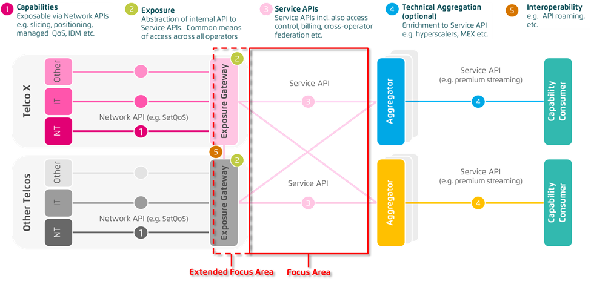

=== API Alliance CNCF Sandbox Project Proposal
*Name of the Project*: API Alliance (tbd)

*Description:*
The development of open, global, and interoperable API solutions could benefit customers and developer ecosystems by giving access to operator capabilities in whatever network customers are in and therefore allow applications to run consistently between telco networks and countries. A new form of collaboration between various players (telcos, ISVs, device manufacturers, hyperscalers, etc.) could address much of the challenges in scaling API services across heterogenous operator architectures as well as advance the connectivity industry towards a more robust and faster core network, encourage the faster adoption of capabilities and as a result create value for the entire tech industry.

* **Accelerate technology development**
** Build sustainable ecosystems around collaborative projects across industries.
** Drive industry alignment by facilitating industry discussions with telcos, ISVs, device manufacturers, hyperscalers, etc.

* **Standardization of APIs**
** Standardize and convert APIs to a user understandable format called “Service APIs”.
** Achieve standardization through working code vs. documents.
** Implementation experience should guide standardization process.
** Enable interoperability (e.g. API roaming).

* **Education and promotion**
** Actively promote Service APIs via various forums, events, conferences, ecosystems and social media.
** Promote best practices by aggregating and publishing lessons learned.

* **Accelerate commercial adoption**
** Create awareness around use cases and services.
** Minimize implementation effort though standardized Service APIs.
** Provide customer service and support.

APIs grouped by services and bundled up into “Service APIs” could reduce the complexity of accessing operator capabilities for developers and enterprises.

Telco Global API Project is an independent open-source project and not controlled by any single company.

*Statement on alignment with CNCF mission*:

* Tbd
* We agree with the CNCF philosophy/vision and would like to contribute.
* Open to integration with other CNCF projects.
* Open to engage the community and enable more innovations.

*Sponsor from TOC:* Chris Aniszczyk (caniszczyk@linuxfoundation.org)

*Unique Identifier:* tbd

*Preferred Maturity Level:* Sandbox

*License:* Apache License 2.0

*Source Control Repositories:* Tbd

*Initial Committers:*

* tbd

*Core Maintainers:*

* tbd

*External Dependencies:*

* tbd

*Infrastructure requests (CI / CNCF Cluster):* tbd

*Issue tracker:* tbd

*Mailing lists:* tbd

*Communication Channels:* tbd

*Website:* tbd

*Social media accounts:* tbd

*Existing sponsorship:* tbd

*Other Contributors:* tbd
